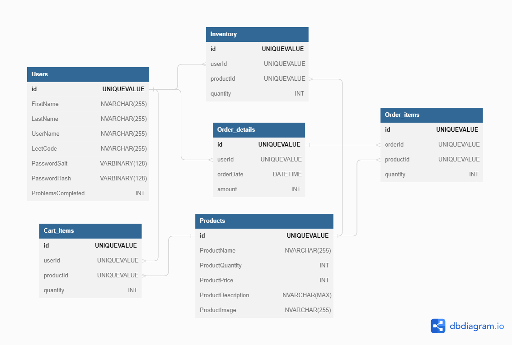

# Project Overview

- The currency is hydrogen and you can buy new elements (fusion). You can earn more hydrogen by completing Leetcode problems.

# Scrum Management

- [Documentation](https://www.atlassian.com/agile/scrum/roles)
- Scrum Master: Jacob
  - Help product owner define value
    - Plan sprints
  - Help development team deliver value and improve
    - Manage blockers
- Development team
  - James
  - Duncan
  - Gregory
  - Chi

# MVP Goals

- User goals
  - As a User Guest, I should be able to see and purchase products (elements) that are usually unavailable during a sale (supernova)
  - As a User or Guest, I should be able to select an amount of a product (element) to add to my cart (fusion reactor)
  - As a User or Guest, I should be able to see a product’s (element) description
  - As a User or Guest, I should be able to remove items (elements) from my cart within the Cart View.
- Application should be accessible from the cloud
- Trigger a supernova sale by creating a specific amount of iron (like a supernova in nature)
- Application should have CI/CD pipeline for frontend and backend that:
  - Runs existing tests
  - Build the application
  - Deploy the application
- Dockerize backend

# Stretch Goals

- As a User Guest or Admin, I should be able to change the color scheme from the normal mode to a dark mode option.
- As a User, I should be able to view a list of all my previous orders and access the details of each order.
- As a User, I should be able to save items to a wish list to buy later.
  - As a User, I should receive notifications whenever an item in my wish list is put on sale.
- ASP.NET Core SignalR
- As a user, I should be informed with a Notification when I have enough Hydrogen to buy certain elements. eg. If (H >= 6) {alert(“You have enough Hydrogen to fuse into Carbon”)}

# ERD

# External API

- Wikipedia API to get snippets about elements
- Leetcode API for currency

# Startup
1. First you will want to clone down both REPOs from GitHub, we recommend using GitBash as your Command Line Interface to run these commands
  * In a terminal , navigate to an area where you would like to store the Fusion Store App.
  * Create a directory to hold both of you repos
  * Navigate inside that directory and clone down each repo.
  `git clone https://github.com/Fusion-P3/FusionFrontend.git`
  `git clone https://github.com/Fusion-P3/FusionBackend.git`
2. Prepare to launch the project in development mode
    * In your Terminal open two windows
     ** In both Window navigate to the directory you created to hold the Fusion Store App
     ** In one window
     `cd FusionBackend/`
     `cd ECommerce.API/`
     `dotnet run`
      `cd ../FusionFrontend/`
      `npm install`
      `ng serve`
          

